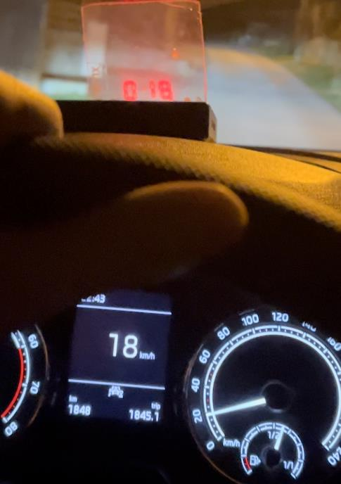

For my practical graduation project I was making a Head-Up Display using a Microcontroller Unit. Here's a summary that I wrote on March 15th, 2024:
>This work deals with the creation of a HUD for a car using an MCU, where thanks 
>to the OBD II port it will display data about driving and the state of the car. 
>The work brings cheaper and more extensive car equipment that most of the 
>older cars do not have. It also promotes safety on the roads. 

In this project I had to learn how to combine my programming, modeling, and electrical skills into one product. It was a rather stressful process, but thankfully in the end I managed to score a B. Soon I will add the documentation and code to my GitHub page.
